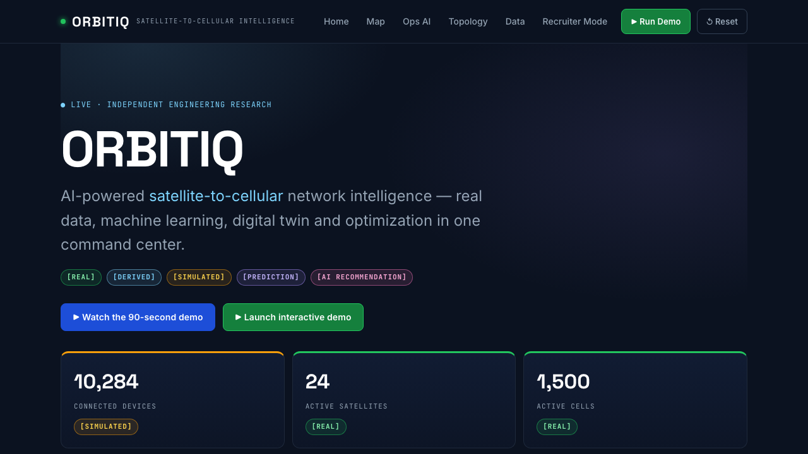

# ORBITIQ

[](https://github.com/sameerhashmiii/ORBITIQ/actions/workflows/ci.yml)
[](LICENSE)

ORBITIQ is an AI-powered satellite-to-cellular network intelligence platform. It fuses public cellular infrastructure data (OpenCelliD) and public orbital data (CelesTrak) into a geographic digital twin with 10,000+ simulated devices, adds machine learning for anomaly detection and connectivity-degradation prediction, an explainable satellite-handoff optimizer, before/after what-if outage simulation, and a grounded GenAI network-operations copilot. It is an independent engineering research prototype, not an operational telecom system.

> **Independence disclaimer:** ORBITIQ is inspired by the technical challenges of satellite-to-cellular connectivity. It uses public datasets, derived engineering features, and controlled simulation. It does not use proprietary SpaceX data, and implies no partnership with or reproduction of any commercial constellation.

## Quick Start

Requires Docker Desktop with Docker Compose:

```bash
cp .env.example .env
docker compose up --build
```

Open <http://localhost:5173> for the command center. API documentation is at <http://localhost:8000/docs>; liveness and readiness are at `/health` and `/ready`.

The backend starts with zero API keys: it loads the checked-in OpenCelliD-format cell snapshot and TLE snapshot, loads the committed trained-model artifacts, and seeds the deterministic device simulator (`SIMULATION_SEED=42`). Local defaults are not suitable for a shared environment.

With an `OPENCELLID_API_KEY` in `.env`, tower data is fetched live from OpenCelliD (cached to `data/raw/`); satellite TLEs are always refreshed live from CelesTrak when online, with snapshots as the offline fallback. Set `ORBITIQ_DATA=snapshot` (as CI does) for fully deterministic runs.

Native development (5 steps):

```bash
cp .env.example .env
python3 scripts/make_sample_data.py
python3 ml/training/train_all.py
uvicorn backend.main:app --port 8000
cd frontend && npm ci && npm run dev
```

## Guided Demo

Press **▶ Run Demo** in the header (or `POST /api/v1/simulation/run`), then work the Ops AI page top to bottom. For the fully automatic version, open **Guided Tour** and press **Start guided tour** (`GET /api/v1/demo/recruiter-script`):

1. Real cellular infrastructure appears on the map (1,500 OpenCelliD-format sites).
2. Live SGP4 satellite positions appear (24 orbital objects, elevation/slant-range/visibility per site).
3. 10,000+ simulated devices appear as an aggregated density grid.
4. Inject satellite congestion (utilization 55% → 94%; device latency climbs past the 100 ms degradation threshold on the affected satellite only).
5. AI detects the anomaly (IsolationForest scores + severity + affected grid area).
6. AI predicts 5-minute connectivity degradation per device (probability, confidence, time-to-degradation).
7. The optimizer ranks candidate satellites and recommends a handoff with per-factor explanation.
8. Run the outage what-if: BEFORE vs AFTER AI optimization, computed live by the twin.
9. Ask the copilot “Why did you recommend this satellite?” for a grounded, sourced answer.



Representative verified states: [global map](docs/assets/screenshots/map.png), [incident timeline](docs/assets/screenshots/incidents.png), [AI prediction](docs/assets/screenshots/prediction.png), [handoff optimization](docs/assets/screenshots/handoff.png), [what-if simulation](docs/assets/screenshots/whatif.png), and [grounded copilot](docs/assets/screenshots/copilot.png). All captures show the real running application against the deterministic demo; see the [capture manifest](docs/assets/screenshots/README.md). The [90-second demo film](video/orbitIQ-demo.mp4) is assembled from the same capture pipeline.

## Architecture

The system is a modular monolith with a clear separation of concerns: a React 18/TypeScript SPA (MapLibre) calls a versioned FastAPI REST API, which orchestrates the digital twin, ML inference, optimization, and copilot services. SQLAlchemy 2 models normalized tables for cells, satellites, devices, telemetry, events, predictions, recommendations, simulation runs, and data sources (PostgreSQL 16 + PostGIS in Compose; SQLite fallback for zero-config demo). Docker Compose starts Postgres, Redis, the API, and the nginx-served frontend.

Provenance boundaries (nothing mixes silently):

- Real data (OpenCelliD CC BY-SA 4.0 with attribution, CelesTrak public TLE, NOAA public-domain space weather) is never replaced by random values; snapshots ship so the demo runs offline.
- Derived geometry (elevation, azimuth, slant range, visibility) is computed, documented, and labeled `[DERIVED]`.
- All device telemetry is seeded simulation (`SIMULATION_SEED=42`, EMA-smoothed for temporal continuity), labeled `[SIMULATED]`.
- Model outputs are labeled `[PREDICTION]`; optimizer outputs `[AI RECOMMENDATION]`; twin reruns `[SIMULATION RESULT]`.
- The LLM only explains precomputed engineering results from structured context; it refuses when data is missing and the network/ML functions work without any LLM key.
- Space weather is contextual display only and is never claimed to predict performance.

See [Architecture](docs/architecture.md), [Data & methodology](docs/data.md), [Engineering decisions](docs/engineering-decisions.md), and [Limitations](docs/limitations.md).

## Behavior And Evidence

The simulator is deterministic: identical seeds produce identical device trajectories and telemetry, verified by test. The degradation labels used in training come from clean simulator state while model inputs are noisy device-observable telemetry only — load columns are deliberately excluded to prevent leakage.

Measured results on held-out simulator data (`ml/evaluation/last_run.json`, reproduced by `python ml/training/train_all.py`):

| Measure | Result |
|---|---:|
| Degradation precision | 0.980 |
| Degradation recall | 0.980 |
| Degradation F1 | 0.980 |
| Degradation ROC-AUC | 1.000 |
| Anomaly detector (IsolationForest, 5% contamination) | scores + severity + grid area |
| Backend tests / coverage | 16 passed / 90% |
| Frontend type check | clean (`tsc --noEmit`) |
| Layout regression (6 routes × desktop/mobile, full AI content) | 0 px overflow |

These values describe the simulator domain, not real networks, and are a reproducibility baseline rather than production performance claims. No accuracy is claimed without evaluation; every metric displayed in the UI traces to real, derived, simulated, or predicted origins. See [Evaluation methodology](docs/interview-guide.md) (Q6–Q9), [Model metadata](ml/models/demo/model_metadata.json), and [Portfolio story](docs/portfolio-story.md).

## Current Stack

- React 18, TypeScript, Vite, MapLibre GL, nginx
- Python 3.9+, FastAPI, Pydantic v2, SQLAlchemy 2
- PostgreSQL 16 + PostGIS (Compose), Redis, SQLite fallback
- scikit-learn (IsolationForest, RandomForest), sgp4 + Skyfield, transparent per-factor explanations
- Pytest + pytest-cov, Playwright (UI capture + layout regression), Ruff, mypy, Bandit
- Docker Compose and GitHub Actions

## Documentation

- [Architecture](docs/architecture.md)
- [Data & methodology](docs/data.md)
- [Engineering decisions](docs/engineering-decisions.md)
- [Limitations](docs/limitations.md) and [Future work](docs/future-work.md)
- [Interview guide](docs/interview-guide.md) (16 questions, implementation-referenced answers)
- [Resume bullets](docs/resume.md), [LinkedIn description](docs/linkedin.md), [Portfolio story](docs/portfolio-story.md)
- [Demo script / storyboard / narration](docs/video/demo-storyboard.md)
- [Data provenance registry](data_sources.yaml) and [Security policy](SECURITY.md)

## Reset And Troubleshooting

Reset the live demo state (devices, events, load) without restarting:

```bash
curl -X POST http://127.0.0.1:8000/api/v1/demo/reset
```

Rebuild everything from scratch:

```bash
docker compose down --volumes --remove-orphans
docker compose up --build
```

If port 5173 or 8000 is occupied, set `FRONTEND_PORT` or `BACKEND_PORT` in `.env` (e.g. `BACKEND_PORT=8001 docker compose up --build`). If the map tiles fail to load, check network access to the public MapLibre demo tiles. If predictions return 503, retrain with `python ml/training/train_all.py`. Model artifacts are committed under `ml/models/demo/` so a fresh clone works without training.

## Development

See [CONTRIBUTING.md](CONTRIBUTING.md) for environment setup, checks (tests, coverage, type check, layout regression, lint), the screenshot/video capture pipeline, synthetic-data rules, and the no-fake-metrics review policy.

## License

Licensed under the [MIT License](LICENSE). Copyright (c) 2026 Sameer Hashmi.
